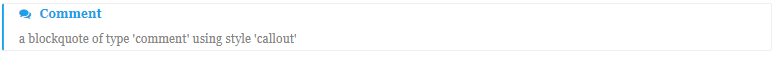

# gitbook-plugin-advance-blockquote


> 参考自插件`gitbook-plugin-flexible-alerts`，调整样式及其生成方式，以支持生成电子书


## Installation

1. add plugin `advance-blockquote`
2. add pluginConfig `advance-blockquote`, configure the plugin so it does fit your needs. A custom setup is not mandatory.
3. By default style 'callout' and headings 'tip', 'note', 'warning', 'danger' will be used. You can change it using plugin configuration via `book.json` or for a single alert in your markdown files.


**Sample `book.json` file for gitbook version 2.0.0+**

```json
{
  "plugins": [
    "advance-blockquote"
  ]
}
```

**Sample `book.json` file for gitbook version 2.0.0+ and style `flat` instead of `callout`**

```json
{
  "plugins": [
    "advance-blockquote"
  ],
  "pluginsConfig": {
    "advance-blockquote": {
      "style": "flat"
    }
  }
}
```

**Sample `book.json` file for gitbook version 2.0.0+ and custom headings**

```json
{
  "plugins": [
    "advance-blockquote"
  ],
  "pluginsConfig": {
    "advance-blockquote": {
      "tip": {
        "label": "提示"
      },
      "note": {
        "label": "注意"
      },
      "warning": {
        "label": "警告"
      },
      "danger": {
        "label": "关注"
      }
    }
  }
}
```

**Sample `book.json` file for gitbook version 2.0.0+  and multilingual headings**

```json
{
  "plugins": [
    "advance-blockquote"
  ],
  "pluginsConfig": {
    "advance-blockquote": {
      "tip": {
        "label": {
          "zh": "提示",
          "en": "Tip"
        }
      },
      "note": {
        "label": {
          "zh": "注意",
          "en": "Note"
        }
      },
      "warning": {
        "label": {
          "zh": "警告",
          "en": "Warning"
        }
      },
      "danger": {
        "label": {
          "zh": "关注",
          "en": "Attention"
        }
      }
    }
  }
}
```

Note: Above snippets can be used as complete `book.json` file, if one of these matches your requirements and your book doesn't have one yet.

## Usage

To use the plugin just modify an existing blockquote and prepend a line matching pattern `[!type]`. By default types `tag`, `tip`, `question`, `note`, `warning` and `danger` are supported. You can extend the available types by providing a valid configuration (see below for an example).

```markdown
> [!NOTE]
> a blockquote of type 'note' using style 'callout'
```


```markdown
> [!NOTE|style:flat]
> a blockquote of type 'note' using style 'flat' which overrides global style 'callout'.
```


As you can see in the second snippet, output can be configured on alert level also. Supported options are listed in following table:

| Key            | Allowed value |
| --------------- | ---- |
| style | One of follwowing values: callout, flat |
| label  | Any text |
| icon  | A valid Font Awesome icon, e.g. 'fa fa-info-circle' |
| className  | A name of a CSS class which specifies the look and feel |
| labelVisible | One of follwowing values: true, false |
| iconVisible | One of follwowing values: true, false |


Multiple options can be used as shown below:

```markdown
> [!TIP|style:flat|label:My own heading|iconVisible:false]
> a blockquote of type 'tip' using alert specific style 'flat' which overrides global style 'callout'.
> In addition, this alert uses an own heading and hides specific icon.
```


As mentioned above you can provide your own alert types. Therefore, you have to provide the type configuration via `book.json`. Following example shows an additional type `COMMENT`.

```json
{
  "plugins": [
    "advance-blockquote"
  ],
  "pluginsConfig": {
    "advance-blockquote": {
      "style": "callout",
      "comment": {
        "label": "Comment",
        "icon": "fa fa-comments",
        "className": "info"
      }
    }
  }
}
```

In Markdown just use the alert according to the types provided by default.

```markdown
> [!COMMENT]
> a blockquote of type 'comment' using style 'callout'
```



Use `[!]`,`[!!]`,`[!?]` for short:
```markdown
> [!]
> a blockquote of type 'default' using style 'callout'
> [!|style:flat]
> a blockquote of type 'default' using style 'flat'
> [!?]
> a blockquote of type '?' using style 'callout'
> [!?|style:flat]
> a blockquote of type '?' using style 'flat'
> [!!]
> a blockquote of type '!' using style 'callout'
> [!!|style:flat]
> a blockquote of type '!' using style 'flat'
```

